# DevOps Website Solution

*Demonstration of how to create a website using a Network File System (NFS) for a shared storage solution and Logical Volume Management (LVM) to manage disk storage. The source code used on this project was retrieved from darey.io.*

*We will implement a DevOps website solution that consists of 4 steps (this one is step 1)*

step 1  https://github.com/Antonio447-cloud/devops-website-solution-using-nfs-and-lvm-step1 

step 2: https://github.com/Antonio447-cloud/load-balancer-solution-using-apache-step2 

step 3: https://github.com/Antonio447-cloud/jenkins-continuous-integration-step3

step 4: https://github.com/Antonio447-cloud/SSL-TLS-cryptographic-protocol-new-dns-name-and-lb-step4

- *We will eventually automate these steps.*

-----------
    Happy learning!
-------------------------------------------------------------

## Outline

We will be using the following components:

- Infrastructure: AWS
- Web servers: Linux: Red Hat Enterprise Linux 8
- MySQL Database Server: Ubuntu 20.04
- NFS Server: Red Hat Enterprise Linux 8
- Programming Language: PHP
- Code Repository: GitHub
- Jenkins: A free and open source automation server used to build CI/CD pipelines.

Web servers share a common database and they also access the same files using Network File System (NFS) as a shared file storage. 

Even though the NFS server might be located on a completely separate hardware, for web servers it will look like a local file system from where they can serve the same files. Consequently, it is important to know:

- What storage solution is suitable for what use cases. In order figure that out, we will need to answer the following questions: 

- What data will be stored? In what format? How will this data be accessed? By whom, from where, how frequently?

Based on the answer to these questions, we will be able to choose the right storage system for our solution. 

## Preparing your EC2 Instances

On the link below, you will find instructions on how to launch and connect to your EC2 instance using an SSH client: 

https://github.com/Antonio447-cloud/MEAN-stack-angular

First, we need to create 3 RHEL instances for our 3 web servers, 1 Ubuntu instance for our database server, and 1 RHEL instance for our NFS server. Our AWS console should look like this:

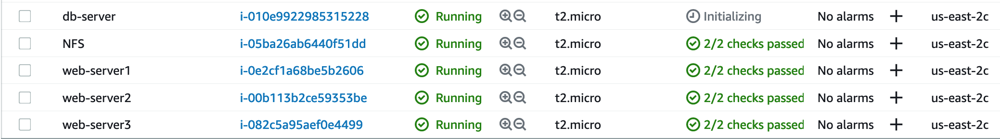

**NOTE**: *All of the instances should be on the same Availability Zone (AZ). In my case all of the instances are on the AZ: "us-east-2c".*

## Configuring Logical Volume Management

Now that we have launched our EC2 instances. We need to configure the LVM (Logical Volume Manager) for our web servers. In order to do that, we will start by creating 3 volumes for our 3 web server's instances. Both, our volumes and our servers will need to be in the same Availablity Zone (AZ). We can configure the AZ when we are launching our instance by clicking on "Subnet" and selecting our preferred AZ:

We will put 10 GB on each volume. To do that we click on "Volumes" we can find it under "Elastic Block Store":

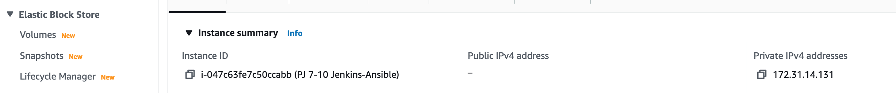

Then we create 3 volumes of 10 GB each. So, first we click on "Create volume" located on the top right corner:

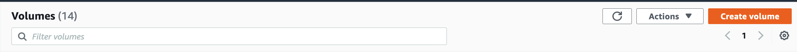

Then we make sure the volume is in the same AZ as our instance and we input "10" on "Size (GiB)":

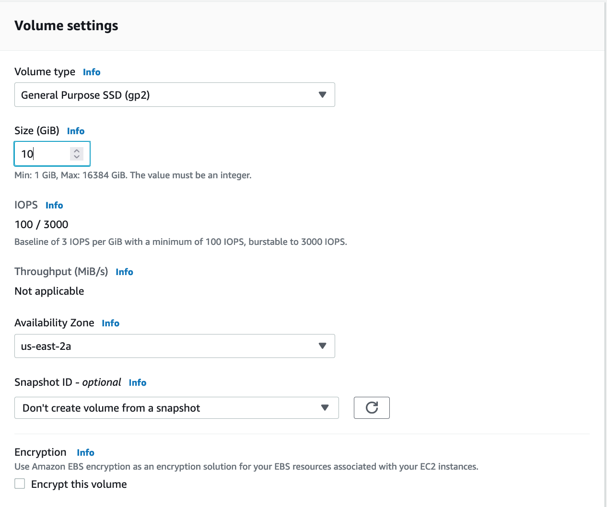

## Attaching the Volumes to your Web Servers

After creating each of the volumes for our 3 web servers, we need to attach each of the 3 web servers to each of the 3 volumes we have just created. Keep in mind that the 3 volumes and the web servers will need to be on the same Availability Zone (AZ). We can configure this by clicking on "Subnet" and selecting the AZ that we want when launching our instance:

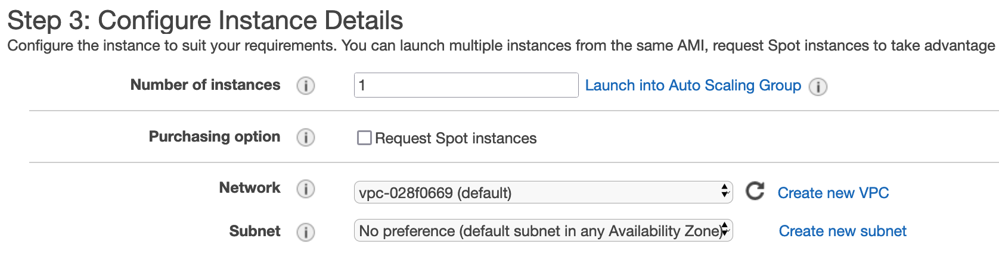

Now, we need to attach each of the 3 volumes to each of of our 3 web servers. To do so we select the volume that we want to attach to our web server then we click on "Actions" and then "Attach":

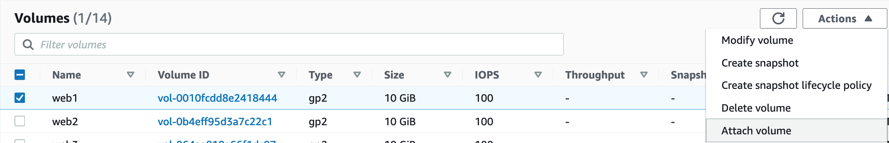

After confirming that the instance we want to attach is on the same AZ as the volume, we click on the drop down menu that is listed under "Instance" then we type the name of our instance, then we click on "Attach volume":

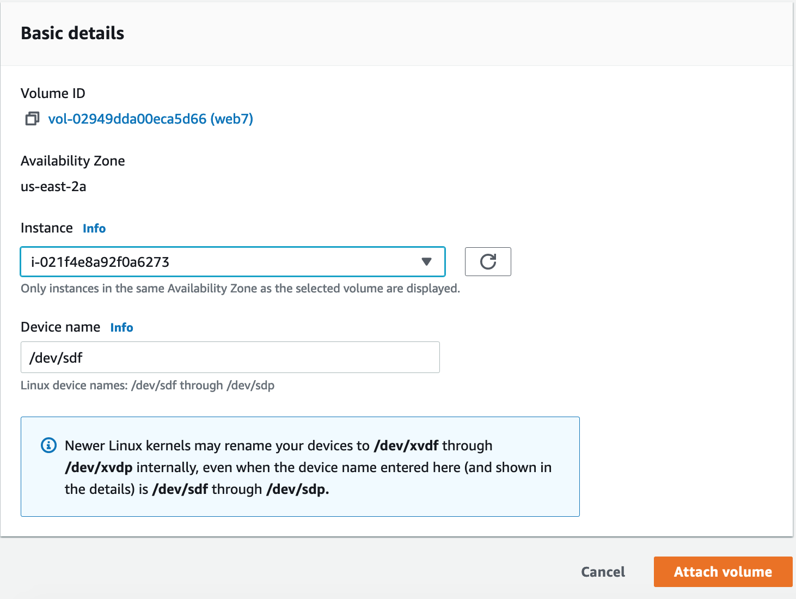

We attach the volumes to each of our 3 web servers:

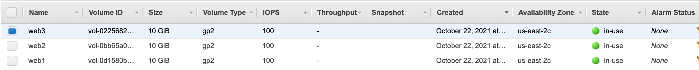

Now, we run `lsblk` to confirm that our block devices are attached to our web server:

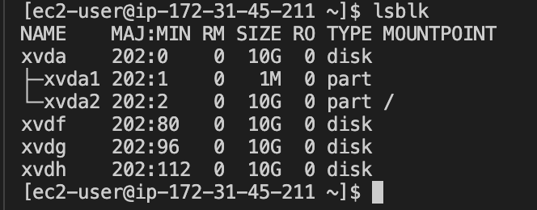

As we can see the block devices are attached to our web server. The names of our block devices are "xvdf", "xvdg" and "xvdh."

After that, we need to run `df -h` to see all mounts available and free space on our server:

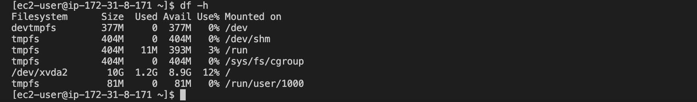

## Creating Partitions for your Block Devices

We will use `sudo gdisk` to create a partition on each of the 3 disks

So: `sudo gdisk /dev/xvdf` 

Followed by:  `sudo gdisk /dev/xvdg` 

And: `sudo gdisk /dev/xvdh`

- We input"n" on "command" in order to create a new partition.

- Then we input "1" or press "enter" for "Partition number".

- We press enter for "First sector" since we want to use the entire disk.

- We press enter for "Last sector" as well.

- Since we want to use this partition for logical volume management we input "8e00" on "Hex code or GUID" to change the type to logical volume management.

- We input "p" on "command" to check what we have so far.

- Lastly we press "w" to write. We can see that our operation was successful.

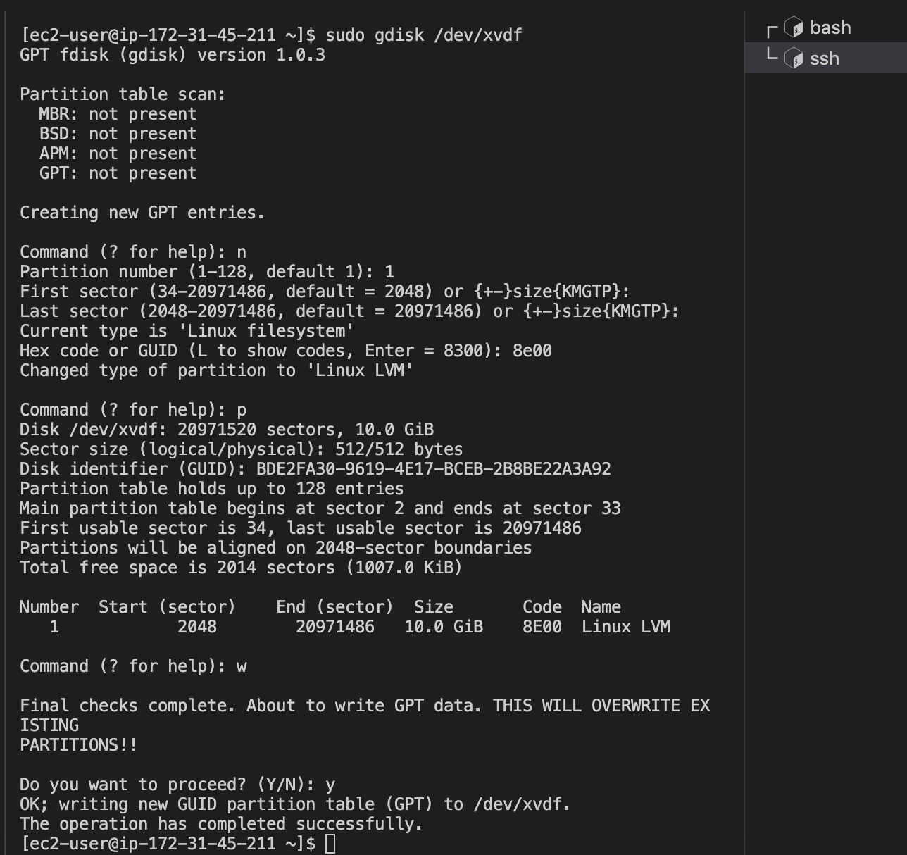

We repeat the same process for the 2 remaining disks and we run `lsblk` after completing the process, it should look like this:

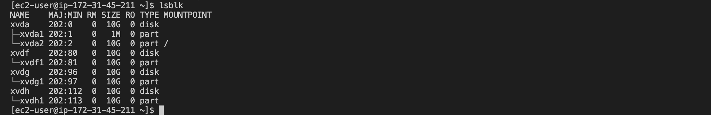

## Installing Linux Logical Volume Management 

Now, we will install the lvm2 package using:

`sudo yum install lvm2 -y` 

Then we check for available partitions:

`sudo lvmdiskscan` 

We confirm that the lvm2 package has been installed:

`which lvm`

## Creating Physical Volumes, Logical Volumes and Volume Groups

After confirming that the lvm2 package was installed, we create a utility to mark each of the 3 disks as physical volumes (PVs) to be used by the LVM:

`sudo pvcreate /dev/xvdf1 /dev/xvdg1 /dev/xvdh1`

To verify that our PVs have been created:

`sudo pvs`

To add all 3 PVs to a volume group (VG) we use `vgcreate`. We will name the VG "webdata-vg":

`sudo vgcreate webdata-vg /dev/xvdf1 /dev/xvdg1 /dev/xvdh1`

We verify that our VGs have been succesfully created:

`sudo vgs`

Now we create the logical volumes for lv-apps, lv-logs and lv-opt: 

`sudo lvcreate -n lv-apps -l 9G vg-webdata`

`sudo lvcreate -n lv-logs -l 9G vg-webdata`

`sudo lvcreate -n lv-opt -l 100%FREE vg-webdata`

We format each of the disks:

`sudo mkfs.xfs /dev/webdata-vg/apps-lv`

`sudo mkfs.xfs /dev/webdata-vg/logs-lv`

`sudo mkfs.xfs /dev/webdata-vg/opt-lv`

We create mount points on the /mnt directory for the logical volumes as follows:
    
- Mount lv-apps on /mnt/apps to be used by webservers.

- Mount lv-logs on /mnt/logs to be used by webserver logs.

- Mount lv-opt on /mnt/opt to be used by Jenkins server in upcoming projects.

So before mounting run:

`sudo mkdir mnt/apps`

`sudo mkdir mnt/logs`

`sudo mkdir mnt/opt`

To get the UUID of our lv-apps, lv-logs and lv-opt we run:

`sudo blkid`

Then we paste each of the UUIDs on our /etc/fstab file using the following format:

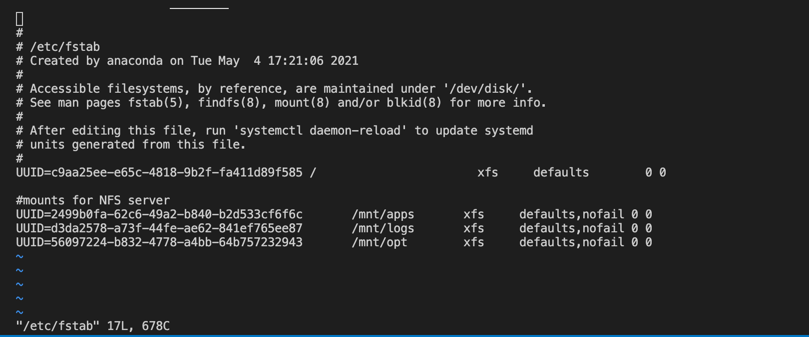

Now we need to install the NFS server and configure it to start on reboot and make sure it is up and running.

So we run:

`sudo yum -y update`

`sudo yum install nfs-utils -y`

`sudo systemctl start nfs-server.service`

`sudo systemctl enable nfs-server.service`

`sudo systemctl status nfs-server.service`

After running those commands, we export the mounts for the webservers’ subnet CIDR (Classless Inter-Domain Routing) to connect as clients. 

For simplicity, we will install all three web servers inside the same subnet, but in a production set up, we would normally separate each tier inside its own subnet for a higher level of security.

To check our subnet's CIDR, we click on the "Networking" tab of our EC2 instance then we click oon the link that is listed under "Subnet ID":

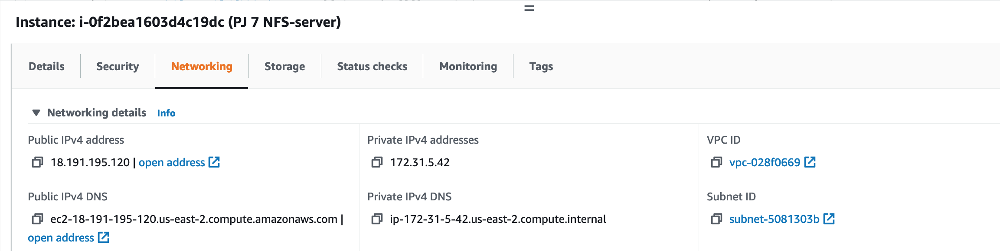

Which will take us to this page where we can see our instance's CIDR:

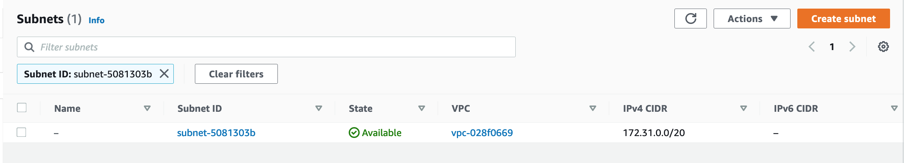

Now we set up a permission that will allow our web servers to read, write and execute files on NFS:

`sudo chown -R nobody: /mnt/apps`

`sudo chown -R nobody: /mnt/logs`

`sudo chown -R nobody: /mnt/opt`

`sudo chmod -R 777 /mnt/apps`

`sudo chmod -R 777 /mnt/logs`

`sudo chmod -R 777 /mnt/opt`

`sudo systemctl restart nfs-server.service`

# *Important Note*: 

- `chmod 4 2 1 0`

- `4` means read, `2` means write, `1` means execute and `0` means no permission.

- On `chmod 400` the first digit represents the user, the second digit represents groups and the third digit represents others.

- `chmod 400` means that only users can read, while groups and others have no permissions.

- On the other hand `chmod 700` means that users can read, write and execute since 4+2+1 = 7 while groups and others have no permissions.

- Lastly `chmod 777` means that everyone (users, groups and others) can read, write and execute. 

Now, we configure access to the NFS for clients within the same subnet. Our subnet CIDR in this case is **172.31.0.0/20**.

So we run:

`sudo vi /etc/exports`

Then we input the following code lines into /etc/exports:

`/mnt/apps 172.31.0.0/20(rw,sync,no_all_squash,no_root_squash)`

`/mnt/logs 172.31.0.0/20(rw,sync,no_all_squash,no_root_squash)`

`/mnt/opt 172.31.0.0/20(rw,sync,no_all_squash,no_root_squash)`

Then we run:

`sudo exportfs -arv`

After that, we check which port is used by the NFS and open it using Security Groups:

`rpcinfo -p | grep nfs`

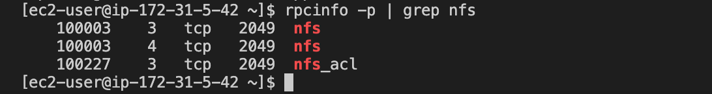

**Important note:** *In order for our NFS server to be accessible from the client, we must also open following ports: TCP 111, UDP 111, UDP 2049.

## Configuring the Database Server

We Install MySQL server:

`sudo apt update`

`sudo apt install mysql-server -y`

We create a database and name it tooling:

`sudo mysql`

`CREATE DATABASE tooling;`

We make sure that our database was created:

`SHOW DATABASES;`

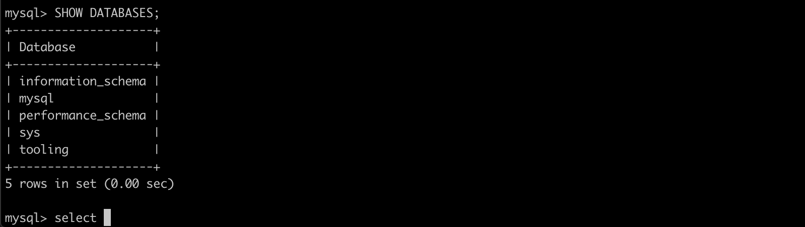

We create a database user and name it webaccess:

`CREATE USER 'webaccess'@'<web-server1-ipv4-CIDR>' IDENTIFIED BY 'password';`

We grant privileges to the webaccess user:

`GRANT ALL PRIVILEGES ON tooling.* TO 'webaccess'@'<web-server1-ipv4-CIDR>' WITH GRANT OPTION;`

We reload the grant tables for the changes to take effect by running:

`FLUSH PRIVILEGES;`

We exit MySQL:

`exit`

- **NOTE**: *We can get the web servers' 1 IPv4 CIDR by going into the "Networking" tab and clicking on "Subnet ID"*:

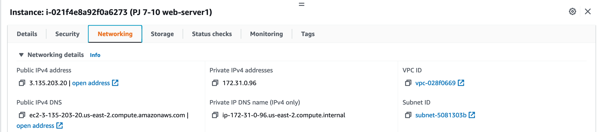

- We can see our web server 1 "IPv4 CIDR" on the right:

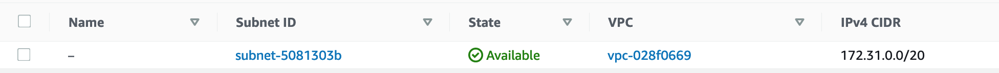

 Now we change the bind address from "127.0.0.1" to "0.0.0.0" so that it is reachable to all IPv4 addresses on the local machine:
 
 `sudo nano /etc/mysql/mysql.conf.d/mysqld.cnf` :

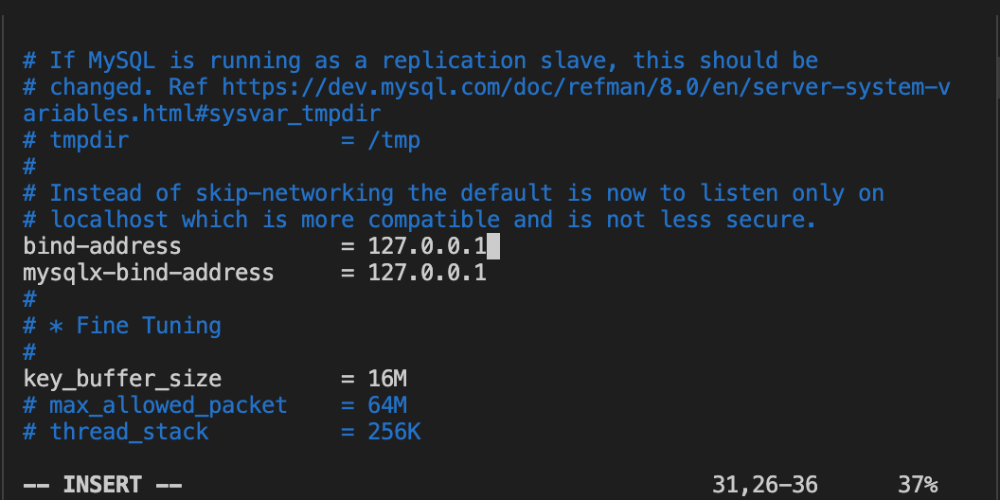

- We can see the edited bind address below:

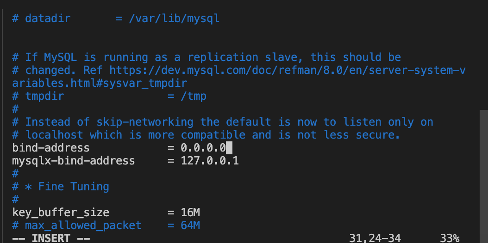

## Preparing the Web Servers

We need to make sure that our web servers can serve the same content from shared storage solutions, in our case that would be the NFS Server and MySQL database.

To store shared files that our web servers will use, we will utilize NFS and mount lv-apps to the folder where Apache stores files to be served to the users (/var/www). We will be doing this so that the shared files that the web clients will use can be accessed for reads and writes. 

This approach will make our web servers stateless, which means we will be able to add new ones or remove them whenever we need, and the integrity of the data (in the database and on NFS) will be preserved. 

During the next steps we will do the following:

- Configure NFS client. (this step must be done on all three servers)
    
- Deploy a tooling application to our webservers into a shared NFS folder.

- Configure the webservers to work with a single MySQL database.

**NOTE**: *Keep in mind our web servers are using the RHEL operating system.*

1.) So now we run:

`sudo yum install nfs-utils nfs4-acl-tools -y`

2.) We mount /var/www/ and target the NFS server’s export for apps:

`sudo mkdir /var/www`

`sudo mount -t nfs -o rw,nosuid <NFS-Server-Private-IP-Address>:/mnt/apps /var/www`

3.) We verify that the NFS was mounted successfully by running:

`df -h`. 

4.) We also make sure that the changes will persist on the web server after reboot:

`sudo vi /etc/fstab`

5.) Add the following line into the /etc/fstab file:

`<NFS-Server-Private-IP-Address>:/mnt/apps /var/www nfs defaults 0 0`

6.) We install Apache:

`sudo yum install httpd -y`

7.) We run Apache:

`sudo systemctl start httpd`

**NOTE**: *Then we repeat steps 1-7 for the other 2 web servers.*

We verify that our Apache files and directories are available on the web server in /var/www and also on the NFS server in /mnt/apps.

So we run:

`ls -l /var/www/` on our webserver EC2 instance.

`ls -l /mnt/apps` on our NFS EC2 instance.

The output should look like this on both instances:
    
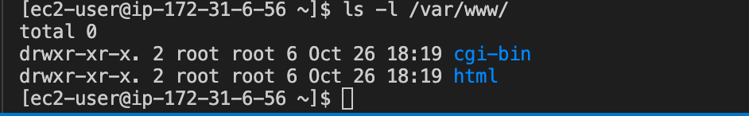

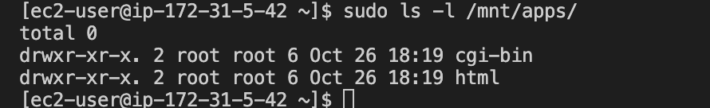

- If we see the same files on both servers it means the NFS was mounted correctly. 

**NOTE**: *We can also create a new file by running: `touch test.txt` from one server and check if the same file is accessible from other web webservers.*

We locate the log folder for Apache on our web server:

`sudo ls -l /var/log/httpd` 

We mount it:

`sudo mount -t nfs -o rw,nosuid 172.31.5.42:/mnt/logs /var/log/httpd`

We make sure it was mounted:

`df -h`

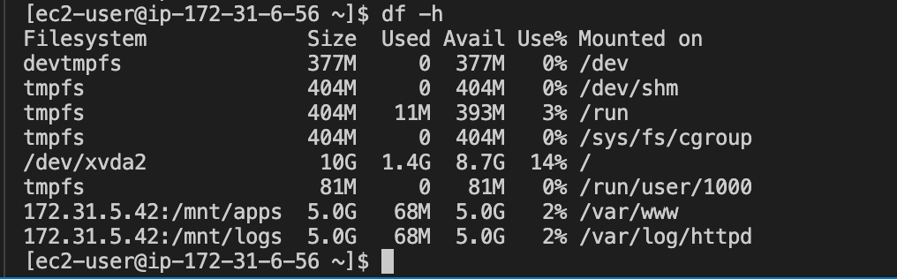

We open the /etc/fstab file and add the mount for the exports. We include our NFS instance private ip address:

`sudo vi /etc/fstab`

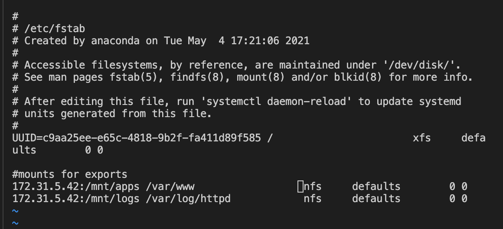

Then we run:

`sudo chown -R root:root /var/log/httpd/`

`sudo mount -a`

`sudo systemctl daemon-reload`

Now you need to fork the "tooling" source code from Darey.io Github Account to your Github account. (https://github.com/darey-io/tooling)

To fork it we click on "Fork" which is located on the top tight corner of the GitHub repository:

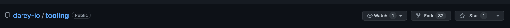

So after forking the previously mentioned tooling repository we run:

`sudo yum install git -y`

`git clone https://github.com/darey-io/tooling.git`

To verify that the repository was cloned:

`ls -l`

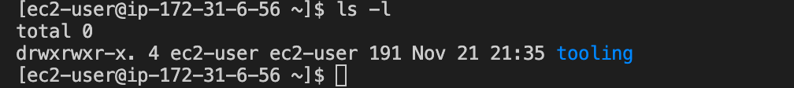

We verify that our "html folder" is in the tooling directory:

`ls -l tooling/html`

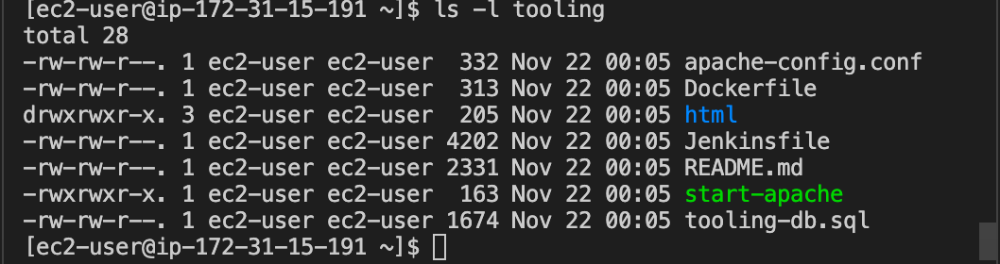

Then we deploy the tooling website’s code to the web server:

`sudo cp -R tooling/html/* /var/www/html/`

We ensure that the "html folder" from the repository was deployed to /var/www/html:

`ls -l /var/www/html`

`ls -l tooling/html`

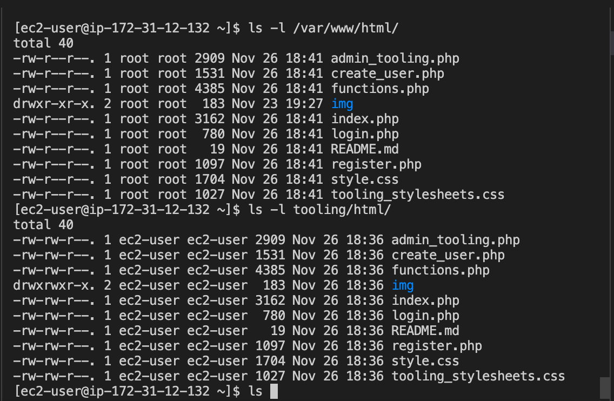

**Note:** *Do not forget to open TCP port 80 on the web server.*

To update the website’s configuration to connect to the database we open our functions.php file:

`sudo vi /var/www/html/functions.php`

Then we input our "DB's instance private ip address", "webaccess", "the password that we chose" and "tooling" next to "db = mysqli_connect":

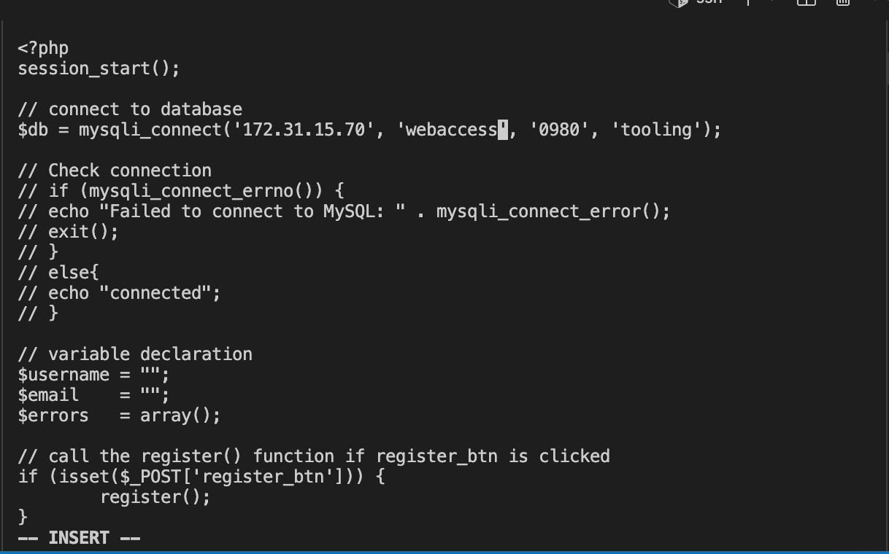

We install MySQL on the web server and apply the tooling-db.sql script.

`sudo yum install mysql -y`

`sudo mysql -h <DB-server-private-IP-address> -u webaccess -p Tooling < tooling-db.sql`

Disable SELinux (ideal for testing), restart our web server, and confirm that our web server is running:

 `sudo setenforce 0`

 `sudo systemctl restart httpd`

 `sudo systemctl status httpd`

 To make this change permanent we open: 

 `sudo vi /etc/sysconfig/selinux `
 
 - and set SELINUX=disabled.

 Now, on our Ubuntu database server we run:

 `sudo mysql`

 `use tooling;` 

`show tables;`

`select * from users;`

We make sure that the password that shows up is the same than we the onw we have on my tooling-db.sql script. In the following images we can see that it is the same:

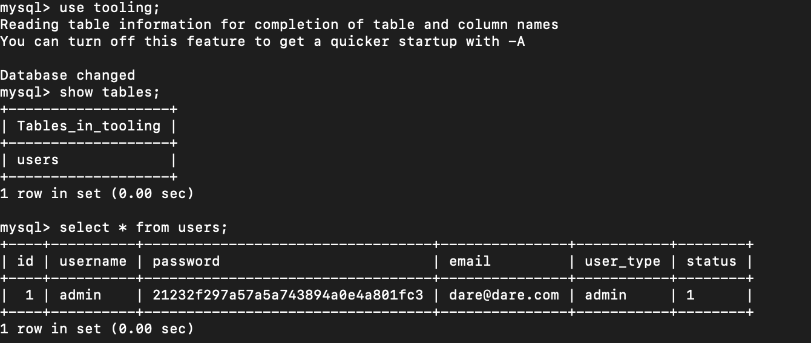

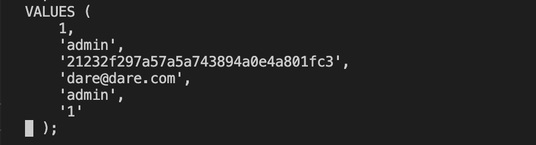

To finish setting up the server, we run the following commands:

`sudo mv /etc/httpd/conf.d/welcome.conf /etc/httpd/conf.d/welcome.conf_backup`

`sudo yum install https://dl.fedoraproject.org/pub/epel/epel-release-latest-8.noarch.rpm -y`

`sudo yum install yum-utils http://rpms.remirepo.net/enterprise/remi-release-8.rpm -y`

`sudo yum module list php -y`

`sudo yum module reset php -y`

`sudo yum module enable php:remi-7.4 -y`

`sudo yum install php php-opcache php-gd php-curl php-mysqlnd -y`

`sudo systemctl start php-fpm`

`sudo systemctl enable php-fpm`

`sudo setsebool -P httpd_execmem 1`

`sudo systemctl restart httpd`

We open our website our my browser:
 
`http://<Web-Server-Public-IP-Address>/login.php`

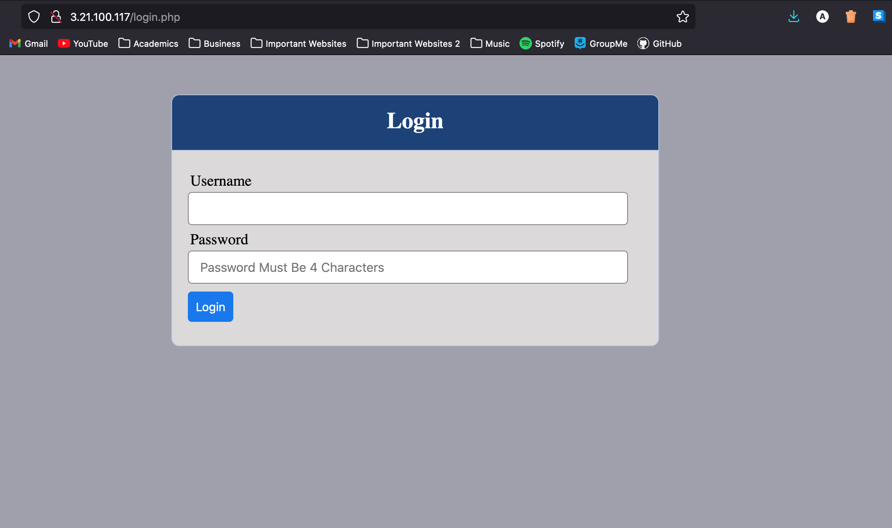

Congrats!! You have just created a website using a Network File System for a shared storage solution and Logical Volume Management to manage disk storage!